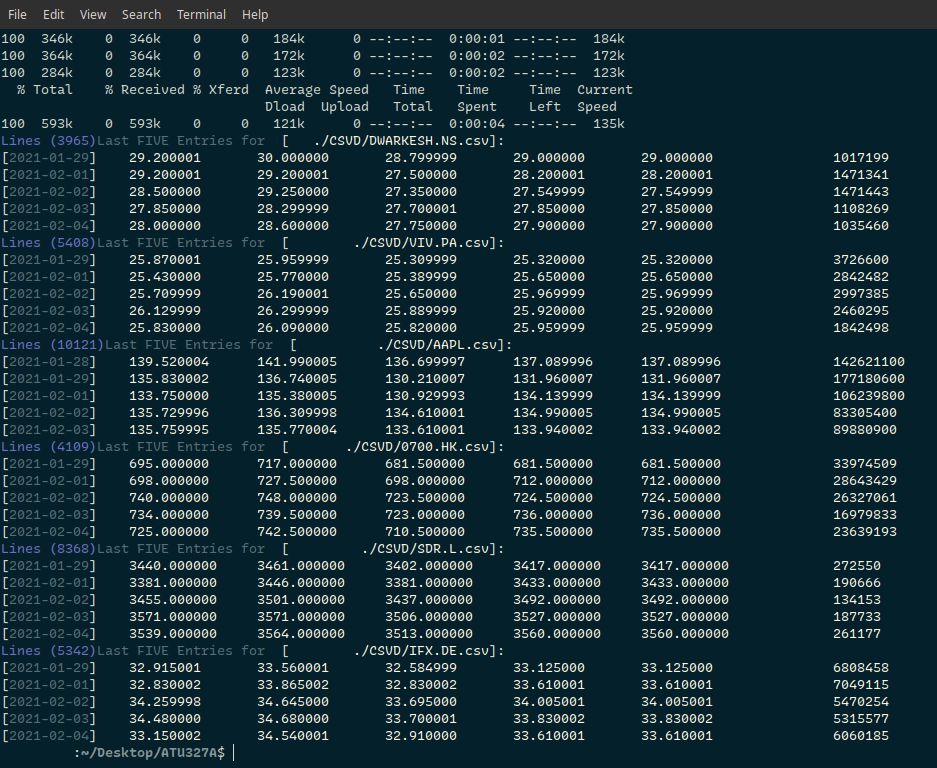

# ATU327A

A short description of first draft of ATU327A framework for a/sync IO and parsing of equity prices.

This draft of ATU327A utilizes
  - Third Party Library: `libcurl`
  - Third Party DataFeed: `Yahoo! Finance public API`

### Objectives of the draft
  - __Constraints, Relaxation and Recommendations__
    - Since the constraints on memory are relaxed and hence the increasing number of translation units in the compilation, simply doesn't matter, nevertheless the constraints on time are albeit sensitive; therefore the application has to be fast and harmonic, reducing major/minor pagefaults. Since the hardware specifications had to be known beforehand, hence only a working hypothesis of a framework would do at this moment. The construction has to be forward-looking as to assimilate and take advantage of incoming compile-time language features. __The emphasis is on being precise and fast rather than reducing memory footprint, which is desired but not actively seeked.__ Also the code must be lucid and self-explanatory.
  - __Reliance on External Libraries__
    - Such as `libcurl` do reduce code size and minimize the time towards generating a working prototype, nonetheless custom-built solution must be achieved to fulfill the role of `libcurl`.

### Conclusion
> __The second draft must contain at least two of the following.__
  - Compile time containers.
  - Low latency FILE I/O (one-to-one wrappers to syscalls).
  - An experimental executable demonstrating the threaded bandwidth usage with `boost::asio`
  - An intelligent scheduler to manage threading on a distributed system.

### License
GPL-2.0 License

### Current Output
Current output of the command `./main DWARKESH.NS VIV.PA AAPL 0700.HK SDR.L IFX.DE`

